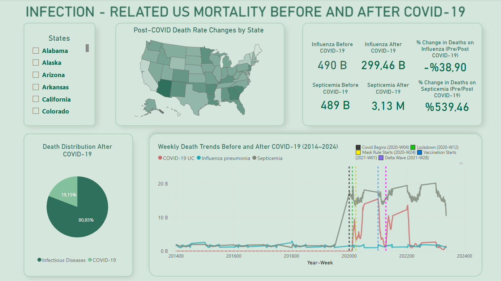

# 🦠 COVID-19 & Infectious Disease Mortality Dashboards

This repository contains Power BI dashboards analyzing infectious disease and COVID-19 mortality trends in the U.S. using CDC and WHO data between 2014 and 2024.

---

## 📊 Projects

### 🔴 COVID-19 Mortality Dashboard

Visualizes the impact of COVID-19 across the United States with weekly trends, death surges, and top affected states.

[➡️ View Dashboard](https://app.powerbi.com/groups/me/reports/1f5aeb12-f745-4740-88f3-8912e3ba2f6b/45dc9ea887ced42eb50e?experience=power-bi)

---

### 🟢 Infectious Disease Dashboard (Before/After COVID-19)

Compares influenza and septicemia mortality before and after the pandemic, highlighting shifts in trends and state-level changes.

[➡️ View Dashboard](https://app.powerbi.com/groups/me/reports/8b68ae7c-2559-48b0-a452-ee3eee5048de/e41cf8b93e25de0b5ad0?experience=power-bi)

---

## 📁 Data Sources

- [CDC - National Center for Health Statistics](https://data.cdc.gov/)
- [WHO - Global Health Observatory](https://www.who.int/data/gho)

---

## ✨ Created by

**Bertuğ Has**  
🎓 Data Science & Analytics  
🔗 [GitHub](https://github.com/bertughas123)
