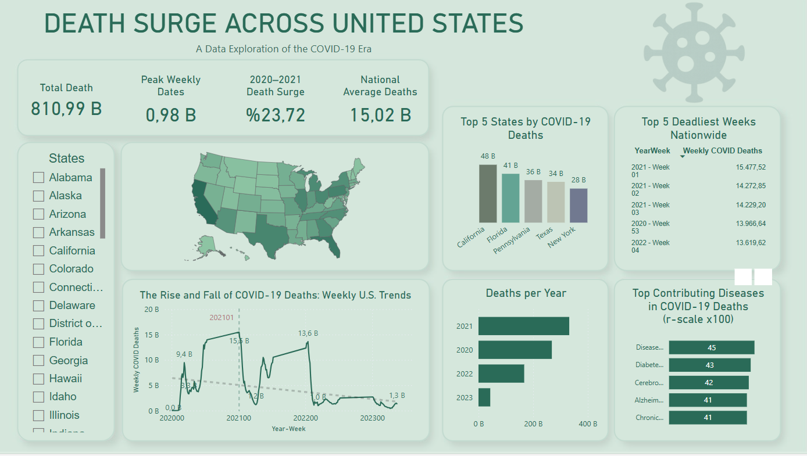

# COVID-19 Mortality Dashboard

This Power BI dashboard analyzes COVID-19-related deaths across the United States from 2020–2024. It uses cleaned open datasets from the CDC and WHO and presents key insights through interactive visuals.

## 📊 Dashboard Preview

## 🔍 Key Features
- Total deaths, peak weekly death counts, and surges between 2020–2021.
- State-level mortality heatmaps.
- Weekly trends and contributing diseases.
- Top 5 most impacted states and weeks.

## 🔗 Interactive Report
[View on Power BI (Public Link)](https://app.powerbi.com/groups/me/reports/1f5aeb12-f745-4740-88f3-8912e3ba2f6b/45dc9ea887ced42eb50e?experience=power-bi)

## 📁 Data Sources
- CDC: [data.cdc.gov](https://data.cdc.gov/)
- WHO: [who.int/data/gho](https://www.who.int/data/gho)

## ⚙️ Created By
Bertuğ Has – Data Science & Analytics Enthusiast
